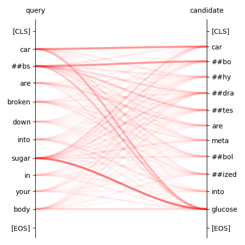

# Retrivex
**Retrivex** is **retri**eval models **ex**plainability toolkit.

Explainability for embedding similarity models (siamese encoders, bi-encoders, dense retrieval models, embedding models, etc.).
Debug your vector search models. Explain output of retrieval component of your RAG or agentic AI system. Detect errors, biases or unintended behavior in your information retrieval system. 

Explain similarity score in a couple lines of code:

```python
# ...
results = explainer.explain(
    "Carbs are broken down into sugar in your body",
    "Carbohydrates are metabolized into glucose")
visualization.plot_connections(*results)
```


## Goal
The goal of the project is to collect and implement specialized methods of retrieval models explainability proposed in academic research into a reliable and generalized toolkit. This toolkit will consolidate state-of-the-art approaches into a practical, standardized framework enabling robustness, reproduciblility and usability for real-world applications.

## Why Specialized Methods for Retrieval Explainability?
Explainability of retrieval models like dense encoders requires specialized methods because their outputs differ fundamentally from classification or regression models. Instead of predicting a class they compute a continuous similarity score between pairs of inputs making classical perturbation-based explainability tools like LIME less applicable. Explanations must capture the interaction between two items (query and candidate), not just features of a single input. Since these models rely on high-dimensional embeddings feature attributions at the raw input level often miss how latent dimensions drive similarity. Therefore, tailored approaches such as gradient-based attribution in embedding space or concept-level alignment are essential for meaningful explanations.

## Why Explainability of Retrieval Models?
Explainability in information retrieval (IR) models is crucial because it helps to understand why certain documents or items are retrieved and ranked higher than others. Transparent explanations improve trust and adoption, especially in high-stakes domains like healthcare, law, or finance, where decisions based on retrieved information can have significant consequences. It also enables debugging and model improvement allowing researchers and engineers to detect biases, errors or unintended behavior in retrieval systems.

## Features of the Project
* Explanation in a couple lines of code
* Seamless integration with SentenceTransformers
* Explainability for your custom fine-tuned SentenceTransformers model
* Visualization tools
* Integrated Jacobians explanability method in accordance to [Moeller et al., EACL 2024](https://aclanthology.org/2024.eacl-long.125/). 
* _To Be Added Next:_ BiLRP explanability method in accordance to [Vasileiou & Eberle, NAACL 2024](https://aclanthology.org/2024.naacl-long.435/)

## Installation
### From sources
You need Python 3.9+ to run code in this tutorial. To install retrivex toolkit from sources run the following command:
```shell
pip install git+https://github.com/aikho/retrivex.git
```

## Example
```python
from retrivex.stransformers import IntJacobianExplainableTransformer
from retrivex.visualization import plot_connections

explainer = IntJacobianExplainableTransformer("all-MiniLM-L6-v2")

results = explainer.explain(
    "Carbs are broken down into sugar in your body",
    "Carbohydrates are metabolized into glucose")
plot_connections(*results)
```

See more examples in the [Tutorial](tutorial.ipynb).

## Documentation
See toolkit API [documentation](https://aikho.github.io/retrivex)

## Tested Models
Integrated Jacobians explainer was tested on the following SentenceTransformers models:
* Original SenetenceTransformers models:
  * `all-MiniLM-L6-v2`
  * `all-MiniLM-L12-v2`
  * `all-roberta-large-v1`
  * `all-distilroberta-v1`
  * `paraphrase-multilingual-MiniLM-L12-v2`
  * `paraphrase-MiniLM-L3-v2`
  * `multi-qa-MiniLM-L6-cos-v1`
  * `multi-qa-MiniLM-L6-dot-v1`
* T5-based models:
  * `gtr-t5-base`
* Gemma Models:
  * `embeddinggemma-300m-medical`
* JinaAI models:
  * `jinaai/jina-embeddings-v2-base-en`
  * `jinaai/jina-embeddings-v2-base-code`
* BAAI models:
  * `BAAI/bge-base-en-v1.5`
  * `BAAI/bge-code-v1`
  * `BAAI/bge-small-en-v1.5`
  * `BAAI/bge-m3`
* E5-based models:
  * `intfloat/e5-base-v2`
  * `intfloat/multilingual-e5-large`
  * `intfloat/multilingual-e5-small`


## Future Work
* Add BiLRP explanability method
* Support of more models for Integrated Jacobians method
* Add implement of other explanability methods
* Add explanability methods for RecSys models
* Add more tools for visualization

## License
See `LICENSE` file.
